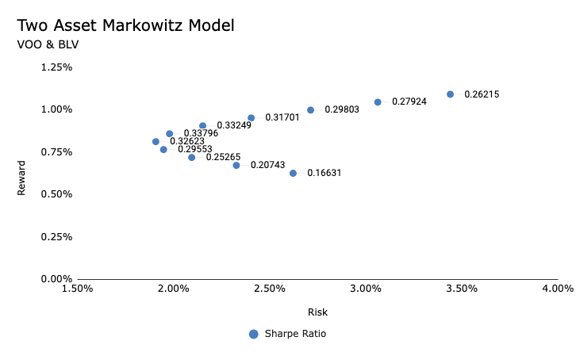

# Portfolio-Management-Projects

Portfolio Optimization using Markowitz Model

https://www.coursera.org/projects/portfolio-optimization-markowitz-model#details

Investment Risk Management

https://www.coursera.org/learn/investment-risk-management/home/week/1

Python for Finance: Beta and Capital Asset Pricing Model

https://www.coursera.org/projects/copy-of-portfolio-assets-allocation-and-statistical-data-analysis

Portfolio Diversification using Correlation Matrix

https://www.coursera.org/projects/portfolio-diversification-correlation-matrix#details

Portfolio Optimization using Markowitz Model Details

https://www.coursera.org/projects/portfolio-optimization-markowitz-model#details

Build a Markowitz model and optimize the two asset porfolio, for the best risk/return ratio, using the efficient frontier.

Tools used:
Excel

Two assets used:
VOO - Vanguard 500 Index Fund ETF
BLV - Vanguard Long-Term Bond Index Fund ETF

Sharpe Ratio
Std Distributions

Using the adjusted close.

Assumption:
Risk Free Rate is 0.19% (PrepPandemic 2020 Monthly return of 10 year treasury bills)

I calculated the mean return, based on the adjusted close, for the VOO and BLV. I then calculated the variance of the returns. After this, I calcualted the standard deviation of the returns. Using this and the monthly risk free rate assumption, I calculated the sharpe ratio. The forumula for sharpe ratio is (E(R) - Rf)/StdDev(Porfolio)

Where 
E(R) = Expected Return of Porfolio
Rf = Risk Free Rate
StdDev(Porfolio) = Standard Deviation of Porfolio

Next I calculated the CoVariance and correlation between these two assets. 

The next step was to create a breakdown of different asset allocations. Example: 50% VOO, 50% BLV or 40% VOO 60% BLV.

I incrementally looked at each asset allocation, jumping by 10% at a time.

With these different allocations, I calculated some metrics for the two asset porfolio. This includes the mean return, the variance, std deviation, and sharpe ratio.

The 50/50 split has the highest sharpe ratio, meaning that this sharpe ratio is more effective, in terms of historical risk to return. Statistically, we get a much better reward for each additional risk taken beyond the risk free rate.

Plotting the efficient frontier.

I used the Std deviation to represent risk on the x axis, and the mean return to represent reward on the y axis. 

On the line plot series, I added the labels, as the Sharpe Ratio.

I also added the efficient fontier as a line that intersects the risk free rate on the y axis and the highest sharpe ratio on the line plot.

# Portfolio Optimization using Markowitz Model
A hands-on project titled "Portfolio Optimization using the Markowitz Model" was completed from Coursera. This project involved showcasing skills in financial portfolio management, utilizing advanced Excel techniques and financial theories.

## Project Overview:
**Objective:** Build a Markowitz model to optimize a two-asset portfolio for the best risk/return ratio using the efficient frontier.

**Tools Used:** Excel
## Key Concepts:
### - Assets Analyzed:
 - VOO - Vanguard 500 Index Fund ETF
 - BLV - Vanguard Long-Term Bond Index Fund ETF
### - Performance Metrics:
- Sharpe Ratio Calculation
- Standard Deviation
- Mean Returns
### - Assumption: 
 - Risk-Free Rate at 0.19% (Pre-Pandemic 2020 Monthly return of 10-year treasury bills)
## Process and Findings:
**1. Data Analysis:** Calculated mean returns based on the adjusted close for VOO and BLV.

**2. Risk Assessment:** Determined variance and standard deviation of returns.

**3. Sharpe Ratio:** Computed using the formula: 
(E(R) - Rf)/StdDev(Porfolio) where E(R) is the Expected Return of Portfolio, R_f is the Risk-Free Rate, and StdDev(Portfolio) is the Standard Deviation of the Portfolio.

**4. Correlation Analysis:** Examined the covariance and correlation between VOO and BLV.

**5. Portfolio Allocation:** Analyzed different asset allocations (e.g., 50% VOO, 50% BLV) and their impacts on portfolio metrics.

**6. Performance Metrics Analysis:** Evaluated mean return, variance, standard deviation, and Sharpe ratio for various allocations.

## Key Findings:
- The 50/50 VOO and BLV allocation displayed the highest Sharpe ratio, indicating an optimal risk-to-return balance historically.
- Developed a plot of the efficient frontier, using standard deviation (risk) on the x-axis and mean return (reward) on the y-axis, and highlighted points with Sharpe Ratio labels.

### Efficient Frontier Line Plot

## Conclusion:

This project represents an intersection between academic theory and practical application in the field of finance. It illustrates the effective use of the Markowitz Model in optimizing portfolio management, with a focus on empirical data analysis and risk assessment. Moreover, it underscores the significance of marrying robust statistical methods with practical market insights to forge more resilient and informed investment approaches.

