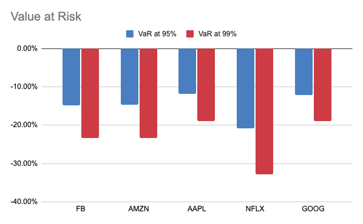
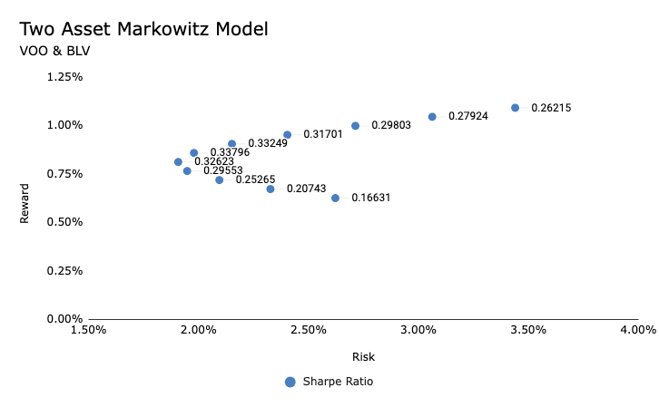
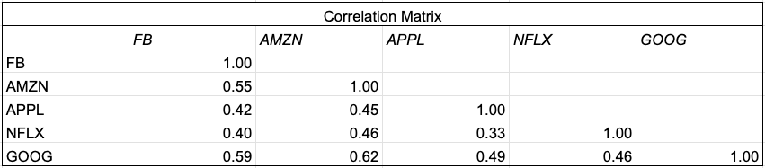

# Portfolio-Management-Projects

## Introduction
The repository showcases a series of projects that underline a growing expertise in Financial Analysis. Each project serves as a platform to display a range of skills and insights gained in financial analysis and investment strategy. The focus is on the effective application of theoretical finance concepts to real-world financial scenarios, highlighting the ability to transform theoretical knowledge into actionable strategies.

## Table of Contents
- [Investment Risk Management](#Investment-Risk-Management-Course)
- [Portfolio Optimization using Markowitz Model](#Portfolio-Optimization-using-Markowitz-Model)
- [Portfolio Diversification using Correlation Matrix](#Portfolio-Diversification-using-Correlation-Matrix)

 

---

# Investment Risk Management Project
This project on investment risk, focuses on the practical application of financial risk management concepts and tools, including the Treynor Ratio and Value at Risk.

## Course Overview
**Objective:** Apply key risk management concepts such as the Treynor Ratio and Value at Risk in the context of investment portfolios.

**Tools Used:** Google Sheets

## Key Concepts:
### Risk Management Techniques:
- Understanding and calculating Beta
- Calculating and interpreting the Treynor Ratio
- Estimating and analyzing Value at Risk (VaR)

### Methodology:
- Monthly returns analysis and standard deviation calculation
- Graphical representation of risk metrics
- Comparative analysis of investment risk factors

## Process and Insights:
- **Monthly Returns and Standard Deviation:** Analyzed the volatility and performance of investments using monthly returns and standard deviation.
- **Beta Calculation:** Calculated the beta of stocks to gauge their market volatility.
- **Treynor Ratio Calculation:** Calculated the Treynor Ratio to assess risk-adjusted returns of investments.
- **Value at Risk Analysis:** Estimated the maximum potential loss in an investment with Value at Risk.
- **Graphing and Conclusions:** Visualized key metrics for a clearer understanding of investment risks and performance.

## Key Findings:
Assessed investment risks and returns through the application of financial metrics, demonstrating the effective utilization of statistical methods in real-world investment scenarios to enhance risk assessment and management.

### Risk Analysis Plot

## Conclusion:
This project connects academic concepts with their practical use in finance, focusing on the detailed analysis of investment risks. It applies these ideas to make better decisions in managing portfolios, showing the importance of using data for risk evaluation in finance.

 
 
 

---

# Portfolio Optimization using Markowitz Model Project
This project uses the Markowitz Model, to optimize a two asset porfolio. Leveraging Excel alongside fundamental financial theories, the project successfully delineates the creation of an efficient frontier.

## Project Overview:
**Objective:** Build a Markowitz model to optimize a two-asset portfolio for the best risk/return ratio using the efficient frontier.

**Tools Used:** Excel
## Key Concepts:
### - Assets Analyzed:
 - VOO - Vanguard 500 Index Fund ETF
 - BLV - Vanguard Long-Term Bond Index Fund ETF

### - Performance Metrics:
- Sharpe Ratio Calculation
- Standard Deviation
- Mean Returns

### - Assumption: 
 - Risk-Free Rate at 0.19% (Pre-Pandemic 2020 Monthly return of 10-year treasury bills)

## Process and Findings:
 - **Data Analysis:** Calculated mean returns based on the adjusted close for VOO and BLV.

 - **Risk Assessment:** Determined variance and standard deviation of returns.

 - **Sharpe Ratio:** Computed using the formula: 
(E(R) - Rf)/StdDev(Porfolio) where E(R) is the Expected Return of Portfolio, R_f is the Risk-Free Rate, and StdDev(Portfolio) is the Standard Deviation of the Portfolio.

 - **Correlation Analysis:** Examined the covariance and correlation between VOO and BLV.

 - **Portfolio Allocation:** Analyzed different asset allocations (e.g., 50% VOO, 50% BLV) and their impacts on portfolio metrics.
 
 - **Performance Metrics Analysis:** Evaluated mean return, variance, standard deviation, and Sharpe ratio for various allocations.

## Key Findings:
- The 50/50 VOO and BLV allocation displayed the highest Sharpe ratio, indicating an optimal risk-to-return balance historically.
- Developed a plot of the efficient frontier, using standard deviation (risk) on the x-axis and mean return (reward) on the y-axis, and highlighted points with Sharpe Ratio labels.

### Efficient Frontier Line Plot

## Conclusion:
This project represents an intersection between academic theory and practical application in the field of finance. It illustrates the effective use of the Markowitz Model in optimizing portfolio management, with a focus on empirical data analysis and risk assessment. Moreover, it underscores the significance of marrying robust statistical methods with practical market insights to forge more resilient and informed investment approaches.

 
 
 

---

# Portfolio Diversification using Correlation Matrix Project
Delving into the strategic implementation of correlation matrices, this project emphasized their role in enhancing portfolio diversification, integrating analysis with practical financial insights. The focus was to apply these  techniques to optimize the investment strategy.

## Course Overview:
**Objective:** Utilize a correlation matrix for optimizing portfolio diversification, enhancing risk management strategies in investment portfolios.
**Tools Used:** Excel

## Key Concepts:
 - Understanding and calculating correlation between assets
 - Creating and interpreting correlation matrices
 - Analyzing asset correlations for porfolio diversification

## Process and Insights:
 - **Introduction to Diversification and Correlation:** Established the foundational knowledge of diversification, emphasizing its importance in risk management.
 - **Calculating Returns:** Techniques for determining investment returns, crucial for understanding portfolio performance.
 - **Graphing Returns:** Utilized visual tools to interpret and compare stock performances and trends.
 - **Creating Correlation Matrix:** Skillfully developed correlation matrices to assess the relationships between different assets.
 - **Analyzing the Correlation Matrix:** Employed analytical skills to draw meaningful insights from the correlation data for informed diversification decisions.

## Key Findings:
 - Demonstrated the ability to utilize correlation matrices for effective portfolio diversification.
 - Gained valuable insights into the interplay between various assets, highlighting an additional tool that can be used to balance risk and return more effectively.

## Correlation Matrix Visualization

## Conclusion:
A Correlation Matrix can be used to identify ways to diversify a porfolio and bridges the gap between theoretical concepts and their application in real-world finance. It underscored the pivotal role of correlation in formulating robust, diversified investment portfolios, enhancing the overall risk-return profile.

